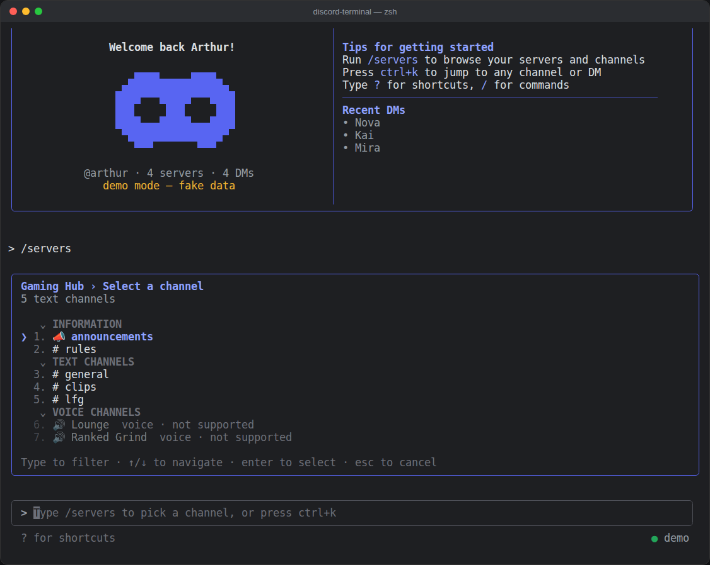

# Discord-Terminal

Discord in your terminal, styled after Claude Code but in Discord blurple instead of orange.


## Features

- **Claude Code-style UI.** It has the same layout as Claude Code: a welcome banner, a rounded `>` prompt box, `/` command autocomplete, `●` message bullets, `⎿` result lines, a `✻` spinner with "esc to interrupt", and `? for shortcuts`.
- **Your real Discord.** You can browse your servers, channels by category, DMs and group DMs. It loads message history and receives new messages live over the Discord Gateway.
- **Sending messages**, with input history, multi-line input (`\` + Enter) and paste support.
- **Quick switcher.** Press `ctrl+k` to fuzzy-jump to any channel or DM.
- **Unread counters and notifications** for DMs and mentions in other channels.
- **Typing indicators** ("Nova is typing...").
- **Discord markdown** rendering: **bold**, *italics*, `code`, code blocks, quotes, spoilers, mentions, channel links, custom emoji, timestamps, attachments and embeds.
- **Permission-aware.** Channels you can't see are hidden. Voice and forum channels are shown but can't be opened.
- **Demo mode** with fake servers, so you can try it without logging in.

| | |
|---|---|
|  |  |
|  |  |
|  |  |
|  |  |

## Install

### Option A: download the app (easiest, no Node.js needed)

1. Go to the [**Releases page**](https://github.com/EnSpecielPerson/Discord-Terminal/releases/latest) and download the file for your OS:
   - **Windows:** `discord-terminal-windows-x64.exe`
   - **macOS:** `discord-terminal-darwin-arm64` (M1/M2/M3/M4) or `discord-terminal-darwin-x64` (Intel)
   - **Linux:** `discord-terminal-linux-x64`
2. Run it **from a terminal**. Use Windows Terminal, PowerShell or cmd on Windows, and Terminal on macOS.

**Windows** (in PowerShell, from your Downloads folder):
```powershell
cd ~\Downloads
.\discord-terminal-windows-x64.exe --demo   # try it with fake data
.\discord-terminal-windows-x64.exe          # log in for real
```
Double-clicking the exe also works; it opens in a console window. If Windows SmartScreen warns you, click **More info → Run anyway**. The exe isn't code-signed, which is normal for small open-source apps.

**macOS / Linux:**
```sh
cd ~/Downloads
chmod +x discord-terminal-*
xattr -d com.apple.quarantine discord-terminal-darwin-*   # macOS only, removes the "unidentified developer" block
./discord-terminal-darwin-arm64 --demo
```

For the best look, use a modern terminal such as Windows Terminal, iTerm2, Ghostty or the default macOS Terminal.

### Option B: run from source

Requires **Node.js 22+**.

```sh
git clone https://github.com/enspecielperson/discord-terminal
cd discord-terminal
npm install
npm link            # optional: puts `discord-terminal` on your PATH

discord-terminal --demo   # try it with fake data first
discord-terminal          # log in for real
```

## Logging in

On first launch you choose a login method and paste a token. The token is saved to `~/.config/discord-terminal/config.json` (file mode `600`). Run `/logout` or `discord-terminal --logout` to remove it.

### Option 1: Discord account (user token)

This shows **your** servers, channels and DMs, just like the real app.

> ⚠️ **Read this first.** Logging in to a third-party client with a user token ("self-botting") is **against Discord's Terms of Service**. Discord can flag or ban accounts for it. Use it at your own risk. **Never share your token with anyone.** Anyone who has it has full access to your account. If it leaks, change your password, which resets the token.

To get your token: open Discord in a browser, open DevTools (`F12`), go to the **Network** tab and click any channel. Find a request to `discord.com/api`, then copy the value of its `Authorization` request header.

### Option 2: Bot account (officially supported)

1. Go to <https://discord.com/developers/applications>, create an app, open **Bot**, then **Reset Token**.
2. On the same page, enable the **Message Content Intent**.
3. Invite the bot to your server (**OAuth2 → URL Generator**, with scope `bot` and the permissions *View Channels*, *Send Messages* and *Read Message History*).
4. Choose **Bot account** at login and paste the token.

A bot only sees the servers it has been added to.

You can also pass a token directly: `DISCORD_TOKEN=... discord-terminal`, or `discord-terminal --token <token> [--bot]`.

## Commands and shortcuts

| Command | |
|---|---|
| `/servers` | Browse servers, then their channels |
| `/channels` | Browse channels in the current server |
| `/dms` | Browse direct messages |
| `/goto [name]` | Jump to any channel or DM |
| `/reload` | Reload the current channel |
| `/clear` | Clear the screen |
| `/whoami` | Show the logged-in account |
| `/help` | Help |
| `/logout` | Forget the token and exit |
| `/exit` | Quit |

| Key | |
|---|---|
| `ctrl+k` | Quick switcher |
| `?` | Show shortcuts |
| `tab` | Autocomplete a command |
| `↑` / `↓` | Input history (or move through autocomplete) |
| `\` + `enter` | Newline |
| `esc` | Cancel a picker or interrupt loading |
| `ctrl+l` | Clear the screen |
| `ctrl+u` / `ctrl+w` | Clear the line / delete a word |
| `ctrl+c` ×2 | Exit |

## How it works

The app is built with [Ink](https://github.com/vadimdemedes/ink), the React-for-terminals renderer that Claude Code also uses. It has no Discord library dependency. It talks to Discord's REST API (`/api/v10`) and Gateway websocket directly. That keeps it small and lets the same code handle both bot and user tokens.

```
src/
  cli.js          entry point, args, token loading
  discord.js      REST + Gateway client, permission checks
  demo.js         offline fake client for --demo
  format.js       Discord markdown → styled segments
  ui/App.js       main screen: transcript, prompt, commands, pickers
  ui/Login.js     login flow
  ui/components.js banner, picker, prompt box, spinner, messages
  ui/theme.js     blurple palette, ASCII logo + mascot
```

## Building the executables yourself

```sh
npm install
bun scripts/build.js                 # all platforms → dist/
bun scripts/build.js windows-x64     # just the Windows .exe
```

Pushing a `v*` tag runs `.github/workflows/release.yml`, which builds every platform and publishes a GitHub Release.
